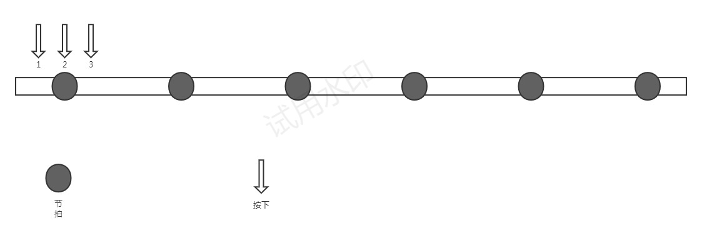
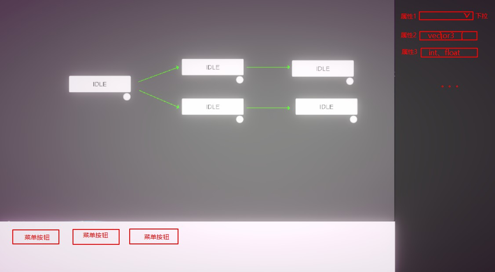

# 2023/04/02 
代码设计更改的一些想法

1. 【DONE】agent status 里的逻辑挪到具体的status里
2. ~~move control 挪到具体的status里，例如idle里的inputcontrol就不会控制移动，run status里，input control只控制转向，只要在run里，就会以speed的速度朝着角色朝向移动。~~  `2023/04/07 move control还在agent里，但是驱动逻辑放在了各个status里`
3. 每个status里添加一个命令队列（考虑直接使用一个数组，或者一个int，每一位表示一个指令），在status的onaction里，判断每种action是直接执行还是要放入指令队列中，对于放入指令队列中的指令，在每个节拍上去处理，这里又要根据status去区分处理，比如有些状态是可以打断的，例如一个runloop占2拍，要进入idle状态，就在第一拍的时候就打断，进入idle。是否打断，也要看当前状态和目标指令之间的关系，例如一个攻击假如占4拍，指令是idle，那就是不能打断的，如果指令xxx，可能就能打断。
4. 【input control也要挪到status里，每个status的input逻辑单独控制。input检测到的指令，处理逻辑参考上一条】待定  目前先放在agent里


# 2023/04/05
1. 【DONE】2023/04/02 工作中的1已经完成初步迁移，还需要进行代码优化和重构
2. 【DONE】2023/04/02 工作中的2经过思考，应该是必要的
3. 【DONE】2023/04/02 工作中的3已经完成初步迁移，还需要进行代码优化和重构
4. 【DONE】2023/04/02 工作中的4再思考一下是否要放到每个status里
5. 【DONE】玩家的指令需要新增一个缓存池，缓存池的指令添加和删除逻辑需要再思考细化一下
6. 【DONE】游戏音乐已更换为HIFI RUSH中的一段
7. 节拍逻辑做了部分调整，所有注册到节拍管理器中的handler，都在节拍到来并完成节拍index自增后再进行调用，保证OnMeter(int meterIndex)里的节拍是当前节拍的index，【TODO】思考是否需要加第0拍和最后一拍
8. 【TO_CHK】全部都使用节拍没有问题，但是如果配合定时器使用，怎么保证定时器结束时是想要的拍子？可能定时器结束比节拍器的调用要早，应该可以通过控制定时器中心的update和节拍管理器的update的调用顺序来保证，看下代码
9. 【DONE】现在有节拍index，但是由于有音乐循环，循环处的index会归零，导致有些逻辑不同通过index去做，想一下怎么处理优化

# 2023/04/06
1. 【DONE】增加角色命令缓存池
2. 【DONE】角色命令部分代码优化 
3. 【DONE】agentanimqueue需要重构，并不是每种状态退出时都要清animqueue的状态，例如连击的combo，就需要根据连击的结果去处理动画（attack 可能会在期间切到idle）
4. 【TODO】新增一个combo处理器，具体逻辑待开发

# 2023/04/07
1. 是combo配置攻击动画播哪个，还是动画配置里定好，combo只负责连击时move next----配在combo里
2. 节拍和按下的逻辑

情况1: 在节拍前按下按键</br>
情况2：在节拍上按下按键</br>
情况3：在节拍后按下按键</br>
问题：只考虑动画播放的问题，不考虑是否在节拍的有效时间内按下。情况1，2,3播放攻击动画，如果都按照接下来最近的一拍去卡攻击动画的拍子，会出现第一拍攻击频率差异很大的情况，加小动画也不能解决该问题，还会带来连招的出招问题，强行加的话感觉这里的逻辑会变得非常复杂，需要一套简单且具有普遍性的动画规则</br>
建议：按下时，计算当前到下个最近节拍的时间，对每个动作设定一个最快的播放速度，如果按照上面计算出的时间来完整播放动画，且速度超过了最快速度，就说明距离下一拍比较近，不会立即进行攻击，而是从下一拍开始播放攻击动画</br>

3. 【TO_DIS】combo中是否会有空拍，应该怎么处理
--------动画结束时停留在结束帧，空拍切回idle状态

# 2023/04/10
1. ~~【DONE】--------情况1--拍子前最多等待0.2s</br>~~
~~【DONE】--------情况3--需要的播放时长/理论播放播放时长 >=0.8直接播</br>~~
~~【TODO】--------情况4--做个起手等待动画</br>~~
2. ~~新问题 跑的时候切idle，左脚停和右脚停，两个切的动画应该不一样，现在用的是idle的默认动画，切换的时候会有点奇怪~~
3. 【DONE】keyboardInputControl全局只有一份，但是inputhandle需要在status初始化时注册进来，切换状态时同时切换inputhandle的enable状态，inputcontrol驱动inputhandle的update，inputhandle处理各自的输入逻辑
4. ~~攻击的输入时间，分为三种情况，怎么处理？ 输入时间内，默认状态是EMPTY，之外的时间，默认状态是IDLE，想一下不是攻击状态这个机制是否也适用~~`攻击输入的前半段时间，动画还在播放，不用管，后半段时间保持攻击动画的最后一帧，过了攻击输入的后半段，还没有输入，就进入idle（特殊情况：如果输入控制的时间调的很长，输入的后半段超过了整个节拍时间，就会出现播完攻击动画后一直卡在最后一帧的情况，所以做了个最长的静止时间的限定，目前是0.2s，即min(输入容差，0.2）是保持动画最后一帧的时间`


# 2023/04/11
1. 以下几个动作是否等拍子需要去游戏中体验一下
    1. RUN
    2. JUMP (仅参考)
    3. DASH
    4. ATTACK
    5. BLOCK (仅参考)
    6. IDLE
2. 动画转换的情况分类：
    1. 等待：等下一拍再切换
    2. 条件等待：
        1. 本拍的剩余时间超过本拍的80%时直接切换
        2. 其他都等下一拍切换
    3. 直接切换
2. 关于状态切换的想法： 
    1. IDLE     ->      IDLE     等待
    1. IDLE     ->      RUN      直接切换
    2. IDLE     ->      ATTACK   条件等待
    3. IDLE     ->      DASH     直接切换
    3. IDLE     ->      BE_HIT   直接切换
    3. RUN      ->      RUN      等待
    3. RUN      ->      ATTACK   条件等待
    3. RUN      ->      DASH     直接切换
    3. RUN      ->      IDLE     直接切换
    3. RUN      ->      BE_HIT   直接切换
    3. ATTACK   ->      ATTACK   等待
    3. ATTACK   ->      RUN      等待
    3. ATTACK   ->      DASH     等待
    3. ATTACK   ->      IDLE     等待
    3. ATTACK   ->      BE_HIT   直接切换
    3. DASH     ->      DASH     等待
    3. DASH     ->      RUN      直接切换
    3. DASH     ->      ATTACK   条件等待
    3. DASH     ->      IDLE     直接切换
    3. DASH     ->      BE_HIT   直接切换
    3. BE_HIT   ->      IDLE     等待
    3. BE_HIT   ->      RUN      等待
    3. BE_HIT   ->      ATTACK   等待
    3. BE_HIT   ->      DASH     等待
    3. BE_HIT   ->      BE_HIT   直接切换
3. 关于输入控制的想法：
    1. 每个攻击动画结束时，理论上是卡拍子结束的，动画结束时默认停在最后一帧不动，如果在攻击输入的时间范围内检测到攻击，则接上上次攻击进行，如果在这个时间范围内没有检测到攻击，就进入idle状态。因此attack状态下的输入控制，做如下设计

        ```

        b0           b1           b2           b3           b4
        |------------|------------|------------|------------|
                |        |   |        |   |        |
                | atkchk |   | atkchk |   | atkchk |
        |-----ATK----|-00-|
        1.       |---K----|--ATK--|(条件等待)
        2.       |---R+K--|-T-ATK-|(条件等待)
        3.       |---R----|-T-RUN-|(条件等待)
        4.       |---D----|--DS---|(条件等待)
        5.       |--------|-IDLE--|(不等)

        b:      节拍位置
        atkchk: 攻击检测
        atkanim:攻击动画
        0:维持之前额动画状态
        K: 攻击按下
        R: 方向键按下
        D: 冲刺键按下
        T: 转向动画
        ATK: 攻击动画
        DS:冲刺动画
        RUN: 跑动画
        IDLE: 空闲动画
        ```

    # 2023/04/12
    1. 【DONE】动画融合机制更改，动画融合改为CrossFadeInFixedTime，动画融合时，新动画的播放速度按照正常全量拍子的时长去计算，新动画做了偏移以保证融合后动画卡点，目前按照这个机制去融合效果还可以
        ```
            /*
         *  假如是一个2拍的动画
         *  1.原始动画时长
         * |----------------|----------------|
         * 
         *  2.按照节拍播完的时长
         * |----------|----------|
         * 
         * 3.游戏进程  0:开始融合  >:融合过程
         * |----------------|----------------|----------------|----------------|----------------|
         * |------0>>-------|----------------|
         *  A动画     B动画
         *         |-------------------------| inTime（想要动画播放的时长）
         *         |--------------------------------|totalMeterLen（B动画原始时长）
         *                                   |------|timeOffset（把B动画向前移动的时长）
         *                                                    
         * 由1，2可以计算出一个动画播放的速度，按照这个速度播放可以保证动画在游戏的两拍内播完
         * 由3可以计算出动画的偏移时长，向前偏移后可以保证动画在节拍处播放完成
         * 动画的融合时间是一个独立值，只是融合过程需要花多久，上面两步是保证卡点的关键计算
         */
        ```
    # 2023/04/12
    1. 【DONE】状态切换的规则再思考确认
    2. 【DONE】把状态切换的逻辑抽成独立方法· `目前抽成了4个方法 1.按照节拍进度条件等待 2.按照节拍剩余时间条件等待 3.立即执行 4.等节拍`
    3. ~~【DONE】目前攻击输入上下容差是0.2s， 但是很难触发，理论上不应该会这么难的，打印日志看下问题原因~~
    4. 【DONE】每个status的input逻辑再整理一下，例如攻击输入时间内可以进行转向操作`节拍处检测一次，只有节拍处有按了方向键，才能改变攻击方向`，攻击过程是否有少量的前移？攻击完成->输入时间截至的这段时间内，动画停止的逻辑
    5. 【TODO】制作场景物体随音乐律动的逻辑脚本 （mono脚本，挂载式）
        1. ~~【DONE】随音乐缩放（分奇数拍和偶数拍）~~`新机制，见2023/04/14`
        2. ~~【DONE】随音乐运动（上下左右）~~`新机制，见2023/04/14`
        3. 随音乐播放特效
        4. 等等 待补充

    # 2023/04/13
    1. 【DONE】攻击动作结束时停在最后一帧，等输入检测结束再进入idle  这里的机制  检测本拍的前半部分输入检测，输入检测时间，定个最大值，超过这个值也进入到idle

    # 2023/04/14
    1. 【DONE】随音乐缩放、移动的脚本已完成，不再使用奇偶机制，而改为配置不同节奏型下的触发设置，目前支持3拍，4拍和8拍的节奏型，应该可以涵盖所需要的绝大部分场景
    2. 【DONE】音乐节拍文件中新加入字段：节奏型 可设置为 3:3拍  4:4拍  8:8拍 
    3. 【TODO】后续还需要加入自定义，每个节拍的数据，以后不仅仅是节拍的时间戳，~~还需要加入触发类型等相关信息，后续根据需求加入，自定义的这种节奏了型，就需要再OnMeter里，读取meter的触发（应该是0,1）~~
    4. 【TODO】需要加入随节拍播放特效或者生成预制件的mono脚本
    5. 【DONE】添加Dash状态  dash手感不好，需要调教
    6. 【TODO】AgentStatus  中 OnCommands和CommandHandleOnMeter是否能重构

    # 2023/04/16
    1. 攻击动画测试，建议改为  0-0-0-0-0.1-0.2.0.3-0.4-0.5-0.6-0.7-0.8-0.9.1.0，数组代表动画的帧代表的动画进度，及开始的几帧是起手的定格帧，接下来是正常的攻击动画，结束帧一定是hit帧
    2. 【DONE】律动不再配置在挂载的脚本上，改为跟随音乐进行配置，音乐的配置文件中配置触发的节奏型
    ~~2. 支持使用自定义配置的律动触发器， 感觉这里需要重构一下，改为传入触发器。做几个类型的触发器就行~~
    3. 【DONE】支持使用自定义的触发数组
    4. 【TODO】UI上制作节拍提示器，先做一个简易的
    5. 【TODO】编写包围盒逻辑，理论上做2D的就行
    6. 【TODO】编写碰撞逻辑，碰撞中心-所有有碰撞的物件注册进碰撞中心-在碰撞中心的update里，每个碰撞体和所有其他碰撞体做碰撞检测，如果发生碰撞，则进行碰撞处理。先使用接口
    7. ~~【CLOSED】动画融合时发现融合的旋转方向反了，然而前后衔接的两个动画的旋转值其实差不太多，需要研究下到底问题出在哪里`问题确认为动画的制作问题`~~

    # 2023/04/17
    1. 确认动画融合是旋转方向反了是动画中模型的朝向问题
    2. 【DOING】轻击-重击-状态切换的时候是否需要带参数--应该可以加上，状态切换并不是特别频繁--但是状态切换这块逻辑不太好抽，需要思考下这里怎么重构
        1. ~~想法1：原来的cmd是一位，表示是否触发，现在cmd，区分为input cmd和cmd action， input cmd 是玩家输入的指令，是一位+参数（但是在update里，参数可能会每帧创建，有点不太优雅， cmd action 是指令行为，是一位+一个action，这里应该没啥问题。OnCommands里，需要从input cmd 转换为cmd action，这里好像也不太好，因为是update里驱动的，也就是说这里的action也可能每帧都要创建，不优雅。~~
        2. 想法2： input cmd 的参数，是否只有方向？ run-移动方向 dash-冲刺方向 attack-攻击方向 ，是否有组合键攻击？做成带参数的之后，每一帧就只能返回一个带参的input cmd，不像现在这样返回一个byte
    2. 【DOING】UI节拍提示器
    2. 【DOING】包围盒
    3. 【DOING】碰撞中心
    4. 【DOING】碰撞

    # 2023/04/18 
    1. 重构了指令缓存和状态切换相关代码
    2. 冲刺的状态，感觉可以改为融合到起始帧，然后播放动画全长的形式，现在动画融合都是按比例融合到合适的帧，对于冲刺这种好像不太合适， 攻击状态思考一下，其实也有这个问题，就是融合完之后动画起始帧太靠后导致第一个动作特别短。`其实可以总结为卡拍子结束帧还是卡拍子起始帧，像跑，idle，攻击这种都是卡拍子结束帧，冲刺这种是卡拍子的起始帧（不用严格卡，因为冲刺是有输入判定的，所以理论上应该是在拍子的前后，应该不会特别违和）`
    
    # 2023/04/19
    1. 动画播放这块，animplayer 是个播放器， 需要新增一个动画驱动器， 可以按照默认的配置去播放动画，或者可以自定义播放顺序
    2. 【DONE】顺序播放的动画驱动器已完成
    3. 【TODO】combo的动画驱动器待编写


        
    # 2023/04/23
    1. GameCollider->ColliderData 要改为纯数据的类,size + offset + ...（后续有需要再加其他数据）
    2. 新增IGameColliderHandler
        bool CheckPosInCollider(Vector2 pos);
        bool CheckCollapse(Rect rect); // 检测例如攻击区域是否攻击到
        bool CheckCollapse(IGameColliderHandler other); // 检测两个碰撞体是否碰撞
        int GetColliderType();
        void OnColliderEnter(IGameColliderHandler other);
    3. GameColliderCenter里有个粒度划分的初始化配置，分块按照这个粒度大小，分成正放形格子，整体是一个二维数组，每个碰撞注册进来之后，算出碰撞应该存放在二位数组的哪些位置上（可能碰撞区域是跨格子的， 如果是贴边的，只存左上角的那个格子）。碰撞更新是个问题，当碰撞体的位置发生变化时，应该更新（更新时机需要思考一下）碰撞体在二位数组中的存放位置，新的位置好算，但是老的位置需要记录么？否则怎么把二维数组中原来这个碰撞体的引用给删除掉？
        一种可能的结构： 
        1. Hashset<IGameCollider>[,] 存储划分后的所有碰撞体信息`这里用hashset还是list需要思考一下，hashset添加删除效率更高，但是不知道有没有需要遍历所有碰撞然后处理的场景，如果有的话，是否无法知道谁和谁比对过了（list可以从0开始依次只和后面的进行比对）`
        2. Dictionary<int, List<int>> 存储collider原来在二维数组的哪些格子里`这个信息不建议存放在collider里，会导致collider不纯粹，这个信息不是collider应该关注的信息，应该时ColliderCenter去负责处理的信息`
        3. 更新时，先查出原来所在格子的index，把collider从原来的格子里删除,然后根据新位置算出新的格子，添加进去

   # 2023/04/26
   碰撞代码结构设计
    ```
    interface - IGameColliderHandler
                |--int GetColliderType();
                |--void OnColliderEnter(IGameColliderHandler other);

    interface - IGameColliderHandler2D : IGameColliderHandler
                |--bool CheckPosInCollider(Vector2 pos);
                |--bool CheckCollapse(Rect area);
                |--bool CheckCollapse(Vector2 pos, Vector2 size, Vector2 offset);

    abstract -  GameCollider2D : IGameColliderHandler2D
                |--size(Vector2) get;private set;
                |--offset(Vector2) get;private set;
                |--scale(float) get;private set;
                |--pos(Vector2) get;private set;
                |--public bool CheckPosInCollider(Vector2 pos);
                |--public bool CheckCollapse(Rect area);
                |--public bool CheckCollapse(Vector2 pos, Vector2 size, Vector2 offset);
                |--public abstract int GetColliderType(){ return type;}
                |--public abstract void OnColliderEnter(IGameColliderHandler other);

        class   PlayerGameCollider2D : GameCollider2D
        class   MonsterGameCollider2D : GameCollider2D
        class   WallGameCollider2D : GameCollider2D
                ......

    class GameColliderCenter
            |--Hashset<GameCollider2D>[,]    所有格子上的碰撞体数据
            |--Dictionary<int, List<int>>   key：collider的hash值， value: collider所在的格子index

            public void AddGameCollider(GameCollider2D collider); 添加碰撞，算出collider有重叠部分的所有格子位置，然后添加到对应格子的hashset里
            public void RemoveGameCollider(GameCollider2D collider); 删除碰撞，根据collider的hash值查出所有格子的位置，去对应的格子中删除这个collider
            public void UpdateGameCollider(GameCollider2D collider); 调用删除->调用添加
    ```

# 2023/05/03
1. combo改为如下数据结构
    ```
    ComboGraph
        |--agentId
        |--agentName
        |--Combo[] combos

      Combo
        |--comboName
        |--ComboStep[] comboSteps(combo的招式数组)

    ComboStep
        |--input(招式类型)
        |--animState(招式动画)
        |--effect(招式效果)
        |--endFlag(combo结束标志)
    ```
2. combo里可能会存在短路的逻辑，如果前面短路了，后面的combo配置就会变为无效配置，因为一旦短路（检测到结束标志），就认为一个combo已经结束，把当前的comboMove记录给清空掉，这里需要再思考一下
3. 如果一个combo的最后一个comboMove结束标志为false是否有问题，即配置的combo没有结束，后续的输入应该怎么处理？
4. 目前错误输入并不会导致combo重置，是否要做强校验？强校验会使游戏难度变得极难
5. 空拍目前貌似做不了，因为空拍会进入idle，但是idle里是没有combo处理器的，所以，combo处理器是否要放在attackstatus里？（好像不能，因为dash攻击也是一个combo，所以combo处理器应该放到agent里，但是空拍的逻辑，需要好好思考一下，【方案1：在有效输入时间范围内，没有检测到任何输入键】
6. 长按的逻辑，目前设想在combo里配增加一个延续上拍的moveType，【方案1：在有效输入时间范围截止前，没有检测到任何抬起】
7. 有个坑爹的地方，多个按键的按下和抬起，需要怎么处理？

5. 音频节奏提取，部分参考资料
    1. https://blog.csdn.net/matrix_laboratory/article/details/53709638
    2. http://yangmingxian.com/2021/07/02/Unity%E4%B8%AD%E7%9A%84%E9%9F%B3%E9%A2%91%E5%88%86%E6%9E%90%E7%AE%97%E6%B3%95-%E4%BD%BF%E7%94%A8-Unity-API-%E8%BF%9B%E8%A1%8C%E5%AE%9E%E6%97%B6%E9%9F%B3%E9%A2%91%E5%88%86%E6%9E%90/
    3. https://blog.csdn.net/keeppractice/article/details/109493052

# 2023/05/06
1. 【DONE】新增一个TriggeredCombo类型，代表已触发的combo
    ```
        private Combo combo;
        private int triggeredAt; 触发index
    ```
2. 【DONE】不再记录已触发的招式列表，改为一个能匹配的combo列表，每次来新输入的时候，对所有处于可触发状态的招式进行新的指令输入，如果可以不能继续触发下一招式，则这个combo就会变为不可触发状态，最终返回第一个被触发的combo，这个combo里有个index指向当前触发的招式。
3. 【DONE】一套combo打完之后（最后一招完成后），combohandler要重置一下，所有的combo都重置为可触发状态，combo里的index重置为-1
4. 【DONE】当有新的输入来的时候，会先经过combohandler的处理，如果handler返回了一个触发的combo，则在当前status里执行带combo的命令逻辑，否则执行正常的命令逻辑
5. ~~【TODO】AgentStatus里对命令的处理和对combo的处理，需要重构优化。感觉之前把每个status对不同指令的处理逻辑抽到一起，并不是一个很好的做法~~`方法更名，根据具体执行的功能逻辑命名，调用时逻辑更加清晰`
6. ~~【TO_DIS】combo的短路问题，会不会有问题~~`可以短路，combo装备的数量不多`
7. ~~【TO_DIS】如果进入idle不能打断combo，那combo怎么才会被打断~~`进idle，run，behit会打断combo`

# 2023/05/07
1. 在收到新的命令时，会先用combohandler去匹配一下触发的combo，如果触发了combo，就调用status的OnComboCommand，没触发combo的话就调用status的OnNormalCommand，各自独立处理逻辑
2. 有个问题，triggerableCombo里有个逻辑，如果检测到错误指令，则将triggerable属性置为false，但是如果来了idle这种指令的话就会直接导致所有的combo都不触发了，所以idle应该不是一个combo触发指令，behit也不是，run应该也不是，需要把这几个指令给排除掉

# 2023/05/10
1. triggerable Combo中加了一个endmeter 记录当前combostep的逻辑结束拍
2. triggercombo的时候，返回一个触发结果
    ```
    public const int ComboTriggerResult_Succeed = 0;
    public const int ComboTriggerResult_NotComboTrigger = 1;
    public const int ComboTriggerResult_ComboExcuting = 2;
    public const int ComboTriggerResult_NoSuchCombo = 3;
    ```
    1. 如果返回ComboTriggerResult_Succeed就调用OnComboCommand
    2. 如果返回ComboTriggerResult_NotComboTrigger就调用OnNormalCommand（不是combo的触发类型，就按正常逻辑走），但是这里有个小的点，进入一些特殊状态会清理combo，是放在status的enter里处理，还是放在这个地方？ 第一感觉是放在status的enter里会好一点，这样每种状态是否清理combo，都在是跟着status走的，后面不用每次都改agent这里的逻辑了。
    3. 如果返回ComboTriggerResult_ComboExcuting，代表在combo逻辑的执行节拍内，目前只给了一个日志信息，后续可能会加上一些ui提示
    4. 如果返回ComboTriggerResult_NoSuchCombo，代表是combo的触发操作类型，但是没有找到对应的combo，也就是打combo失败了，这种情况下，暂时也只是给了一个日志信息，~~后续可能会加一些ui提示，或者有一些很小的惩罚机制，引导玩家尽量跟着节拍去按~~

# 2023/05/12
1. 【DONE】hit点要改到status配置文件的animstateinfo里去，用一个数组，标记这个state的百分之多少有一个hit点，combo里配置一个效果数组，但是hit点所在的位置不配置再combo里。效果数组里要有一个mode（独占模式：招式效果完全使用配置|叠加模式：招式效果为基础效果+配置效果），一个effectType，一个effectvaule
2. combo的stepdata里配置statusname和statename，用来去statusgraph数据中匹配到对应的动画，statusname和statename都是必填项
3. 每个agent的j和k键对应的默认statename应该是定死的
4. dash默认的stateName也应该是定死的
5. 需要新增一个combo执行器，在update里检测progress，（onmeter里是否需要？）这里有一个问题，假设配置了一个hit点是100%，有没有可能update里达不到100%的progress，需要考虑一下
6. 特效是配置在stateinfo里还是combo里？ 倾向于配置在stateinfo里，combo只确定播放的动画是哪个，效果是啥，动画确定了，应该特效就确定了。
7. 这样的话还需要一个特效发生器
8. 碰撞配置？


# 2023/05/13
1. combo修改了一波
2. 【DONE】新增了一个status：过度状态，就是攻击combo完成之后的那个不受保护的后摇状态

# 2023/05/14
1. 【DONE】所有使用GetHashCode作为key的地方都进行了修改，GetHashCode存在hash碰撞的可能，尽量不用来做key
2. 【DONE】音乐节拍的计时时间改为从音源直接获取当前音乐时间
3. 【DONE】攻击的第一拍取消攻击前摇，改为前半拍直接截断执行，后半拍等拍子执行
4. 【TODO】combo的效果，改为一个数组的数组，支持一个hit点配置多个效果。攻击效果一定是叠加普攻的，如果不配置攻击效果就没有攻击效果

# 2023/05/17
1. ComboTrigger里 重置所有combo有问题，目前是在OnMeter里重置combo的，但是OnMeter比input的update要晚，导致新的update来的时候，combo还没有被正确重置，也就无法正常检测到combo， 这里考虑弄个池子，然后把触发的combo copy给出去
2. Combo的重置不应该在拍子上，这样会导致结束拍的前半拍输入是无效输入，所以是否应该是combo的重置放在combo的执行逻辑里，如果是结束招式，执行了就立马重置

# 2023/05/18
1. 关于combotrigger这里，准备改为触发时只把combo的数据层传出去，而不是传triggerableCombo，因为涉及到重置问题，如果把triggerableCombo传出去了，然后又在中间态改变了里面的数据，就很难维护了

# 2023/05/21
1. meterIndex 对外暴露的都是自增后的唯一index， 外部判断时不用再考虑循环逻辑，MeterManager内部处理时将循环逻辑带掉
2. OnMeter改为OnMeterEnter和OnMeterEnd两个方法，但是逻辑上有个很难受的地方，调用逻辑如下
    ```
        // 获取节拍在音乐中的index
        int meterIndexInMusic = GetMeterIndexInMusic(MeterIndex);
        if (timeRecord >= mCurAudioMeterData.baseMeters[meterIndexInMusic + 1])
        {
            // 节拍结束
            TriggerMeterEnd();
            // 节拍自增
            MeterIndex++;
            // 节拍开始
            TriggerMeterEnter();
        }
    ```
外部调用时，先调用的OnMeterEnd，此时meterIndex还是上一拍的index，代表上一拍结束，然后meterindex++，再调用OnMeterEnter，此时meterIndex已经自增过，外部拿到的meterindex，一个尾，一个头，需要调用时特别注意
3. 【DONE】还有个难受的地方，就是combo打完切到transfer状态的逻辑，现在是用了一个标记并记录了转换时间，感觉这俩属性放着非常违和，并不应该是attackstatus的内部属性，想要加个MeterEndAction，可以主动注册，然后在OnMeterEnd里判断节拍到了就调用，但是这里的meterIndex处理的时候，感觉有点难受，能否抽一个方法，判断是否到了在方法内部统一处理了`添加了一个MeterEndAction，CheckAndExcute(meterIndex),这里有个不爽的地方是，传入的meterIndex，应该=logicEndMeter-1，这里想办法再优化一下`
4. combo处理这块还有问题 dash-attack这个combo， 开始是在dash状态里，等检测到了attack的时候，触发了combo，这时会播放动画（在dash状态里播放了attack动画），然后切换到attack状态，这么做就不太对了`目前改为带combo切换到attack状态，然后由attack状态去处理该combo和指令`

# 2023/05/22
1. 指令的处理逻辑和combo的处理逻辑，再思考总结一下，需要找到其中的规律抽象出来，感觉现在这块很不健壮，经常会出现各种小问题
    1. 直接执行指令
    2. push到buffer，等节拍
    3. 根据节拍进度执行（前半拍直接执行，后半拍push到buffer）

    4. idle时有attack指令，此时会直接执行指令，但是attack内部，又会根据节拍进度执行，即虽然idle检测到attack会立马进入attack状态，但是可能并没有立即进入到attack的实际逻辑中（有可能在后半拍在等拍子）
    5. attack时有dash指令，此时会等拍子，dash内部，又会根据节拍进度执行

    6. 指令执行感觉有点混乱，需要定一套规则，统一一下。

    7. combo这块，目前也给了一个缓存，用来在等拍子的时候存储一下，但是清理逻辑需要再思考下
    8. ConditionalChangeStatusOnCommand，ChangeStatusOnNormalCommand，ChangeStatusOnComboCommand 不对称

# 2023/05/24
1. 【DONE】所有计算结束拍的逻辑进行了调整，比如第一拍开始，占1拍，那结束拍还是第一拍，即第一拍结尾处结束
2. 【DONE】传指令的地方，统一改为传指令数据（类型，方向，节拍）
3. 【DONE】新增了状态的默认逻辑代码段，计划把combo改回覆盖和叠加模式
4. 【DONE】status配置，删除loop字段和animName字段

# 2023/05/25
1. 【DONE】OnNormalCommand和OnComboCommand进行合并
2. 【DONE】添加状态的默认行为逻辑
3. 考虑添加一个击飞状态，和普通的受击状态进行区分？
4. 步进式的动画驱动器，考虑改成传动画参数，这样配置文件和自定义都可以使用步进式动画驱动

# 2023/05/30
1. 【DONE】场景新增_SCENE节点，对该节点进行了45度的旋转，_MAP节点和_AGENT节点都放入_SCENE节点下
2. 思考 碰撞这块，是统一传localpos，localrot  还是统一传worldos， worldrot?
3. 新增了GameColliderView，在这个组件上编辑碰撞的范围，gizmos显示碰撞范围
4. 地图物件设计思路：
    1. 通过数据层加载prefab，即数据层加载后，要加载表现层，此时就加载对应的prefab，碰撞信息此时也可以去表现层取到
    2. 通过场景中预制的prefab，注册到数据层，数据层上，场景中预制的这些物件，不进行持久化存储，即这里的数据层注册不是通过加载配置文件初始化的，而是场景中的物件，挂载一些脚本，然后这些脚本的start或者awake里，向数据层去注册数据
    3. 这样所有的碰撞信息都保存在prefab上，colliderdata2d是采集prefab上gamecolliderview里的碰撞数据生成的

# 2023/06/02
1. 碰撞模块的问题
    1. 缺少对一个rect进行碰撞检测的方法
    2. 碰撞缺少对递归逻辑的处理，比如检测到碰撞而要移动，调用移动时又会触发碰撞检测的递归
    3. 碰撞这块，是传入collideProcessor还是把检测到的碰撞返回出去？
    4. 场景中的两个相交碰撞区域，检测碰撞检测不到，查一下碰撞逻辑是否有问题


# 2023/06/03
1. 缺少一个地图编辑器，设想单独有一个scene可以作为地图编辑器使用，选择类型，选择prefab，配置基础数据后，点击添加按钮，会自动在场景里对应的节点下加载出来对应的物件，上面自动挂载该类型对应的组件。保存的时候，针对每个类型的根节点，想下寻找挂载地图物件类型的节点，读取数据后存储
2. 存储的数据格式？设想为使用protobuf，这样的话，原始数据格式就要写在.proto文件里，然后有个一键生成C#对应类的辅助方法，编辑器下就直接使用protobuf在C#里相应的方法了。
3. 如果自定义数据格式
    1. xml 可行，但是加载效率不高且需要手动加密，加载需要手动处理
    2. json 可行，但需要手动加密，可以自动化加载
    3. 自定义二进制文件 可行，文件体积小，但数据存储格式需要花费很大功夫，且扩展性不是很强，加载需要手动处理

4. 计划： 
    1. Entity-View整体设计完善
    2. 地图数据的编辑器，保存和加载
    3. 对接碰撞管理和碰撞逻辑

# 2023/06/04
    1. 四元数：

        到欧拉角：quaternion.eulerAngles

        到方向向量：(quaternion * Vector3.forward).normalized

    2. 欧拉角：

        到四元数：Quaternion.Euler(vector3)

        到方向向量：(Quaternion.Euler(vector3) * Vector3.forward).normalized

    3. 方向向量：

        到四元数：Quaternion.LookRotation(vector3)

        到欧拉角：Quaternion.LookRotation(vector3).eulerAngles

    四元数到欧拉角可以使用它内部自带的eulerAngle属性，变为方向向量可以将它乘上Vector3.forward（向前，为什么是向前呢…因为我看到模型导入的时候默认朝向是朝向蓝色轴，也就是z轴，所以就这样了）

    欧拉角转四元数可以通过Quaternion的Euler方法转，到方向向量则借助四元数来转。

    方向向量可以使用Quaternion的LookRotation转，然后再用借助四元数来获取欧拉角。

# 2023/06/06
1. 受击态和击飞态分成两种状态，因为击飞态需要几个动画自动做衔接，和受击态的动画无法放到一起
2. 怪物AI框架思考-应该就是一个状态机，但是可能需要一个编辑器，支持策划手动修改怪物AI
3. 关卡管理器
    1. 地图
    2. 怪物加载和随机
    3. 掉落加载和随机
    4. 其他和关卡相关的逻辑控制


 ### 怪物ai编辑器示意图
 
 1. 添加初始行为->添加后续行为->添加转换条件
 2. 选中行为编辑行为数据，选中转换条件编辑转换数据
 3. 导入AI文件，导出AI文件
 4. 这里应该不给预览功能，AI涉及的情况过于复杂，没办法模拟全部数据。编辑完AI之后，到游戏里实际体验，代码问题改代码，逻辑问题改状态机

# 2023/06/07
1. 上面的AI编辑器和AI框架有问题。理想中的AI应该是</br> 
 条件判断->执行指令->条件判断->执行指令的过程</br>
 但是按照这个思路做的话，其实只是编辑一个一个独立的条件判断和执行，每一个 条件+执行 和其他的 条件+执行 都是相互独立的，没有制作编辑器的需要
 还有个问题，条件判断可能会是多个，比如当前在idle状态，且血量高于80%，且周围没有敌人，就原地休息之类的逻辑
2. 如果使用硬编码，就会导致扩展性比较差
3. 好一点的设计是使用行为树，但是代码编写比较麻烦，而且效率会差
4. 还会存在链条式的指令执行需求
5. 还有一个问题，AI的设计，是不是设计为只在节拍上进行AI逻辑的变化

# 2023/06/09
1. 为AI开发行为树模块</br>
    https://blog.csdn.net/linxinfa/article/details/124483690</br>
    https://indienova.com/indie-game-development/ai-behavior-trees-how-they-work</br>


# 2023/06/10
1. 目前行为树大致分为
    1. entryNode 进入节点
    2. composite 组合节点
    3. decor 装饰节点
    4. leaf 叶子结点（包括 条件检测和行为执行）
2. 行为树的数据计划使用json存储
3. 新增BehaviourManager管理器，行为树文件加载和数据缓存，结点生成和管理都计划在管理器里做
4. 行为树的驱动逻辑，生命周期都有agent来管理

# 2023/06/15
1. 行为树节点，考虑是否加入父节点的引用 -- 加入
2. 编辑器内的修改，是直接修改数据，然后通过数据重新绘制，还是修改表现，最后从表现层读取数据保存？ -- 修改数据，表现层同步
3. 编辑器要做个对象池，否则更新的时候浪费资源  -- 使用UIEntity的缓存池机制
4. 编辑器，添加新节点，选择节点类型，属性面板的设计，结点可以更改在同一级下的顺序 

# 2023/06/19
1. 添加子树
2. 行为/条件
    1. 待机 -- 进入Idle状态
    2. 
    3. 
    4. 
    5. 


进入的时候，怪是在待机状态


# 2023/06/21
1. 行为树可以添加子树，数据上，子树只记录树名，使用时将树名转换为树的文件路径，将所有子节点都加载进来
2. 树的入口节点(treeEntryNode)和子树节点(childTreeNode)是两种不同的节点，子树节点下挂的一定是树的入口节点，树的入口节点不能直接作为子树节点添加，因为数据上没法区分处理
3. 准备开始对接碰撞逻辑

# 2023/06/22
1. 碰撞逻辑如果在传入的handle内部处理，那么对于移动控制，要判断是否发生了不能穿越的碰撞之后再决定是否移动的逻辑就没办法写了，需要想一下怎么处理。`是否可以通过返回一个int（32位），如果不够用，就long（64位）标记都碰到了那些类型的碰撞体，一个类型占一位`
2. 目前碰撞判断，都需要生成GameCollider碰撞体，计划碰撞体里要传入对应的entity，如果是攻击检测，应该并没有碰撞体对应的entity，只有一个rect，所以这块要改成，最底层的碰撞判断都是一个rect和已经注册进来的碰撞体做碰撞检测。还是说攻击也生成一个entity？
3. 发生碰撞的两个碰撞体，如果都有对对方的处理逻辑，可能会有重复处理的情况，应该怎么规避？

# 2023/06/30
1. 事件分为了Fire和Post两种类型，Fire发出后会立刻通知监听者，Post会放入一个队列中，在update中执行。Post也是会按照事件抛出顺序执行，同一个事件名，后post的不会覆盖前面Post的事件。
2. 新增一个行为树节点时，需要：
    1. BTDefine里添加对应的类型
    1. 添加对应节点的脚本
    1. BehaviourManager里的CreateBTNode中添加创建逻辑
    2. ControlAddNewNode 的 prefab里添加对应按钮， 代码里添加对应button逻辑
    3. 添加对应的NodePropertyPage的prefab，添加对应的脚本
    4. ControlAIOperatironArea里增加加载对应NodePropertyPage的逻辑

3. 寻路计划使用navmesh，部分参考资料
    1. https://wo1fsea.github.io/2016/08/21/A_Quick_Introduction_to_NavMesh/
    2. https://blog.csdn.net/needmorecode/article/details/81807071
    3. 待研究方案(生成方案，保存，加载方案，寻路算法)...


# 2023/07/09
1. 【DONE】受击动画改为不卡拍
2. 逻辑指令不要再触发combo，这个到底是要区分输入指令、逻辑指令还是用其他机制，再仔细思考一下
3. 受击指令做成两种指令类型，后续可能需要增加指令类型，具体再思考一下
4. 冲刺结束是否还要卡节拍？
4. 准备研究下打包机制和打包策略
5. 优化一下转表工具，转表后每个类可以直接使用，进入游戏直接加载所有表数据